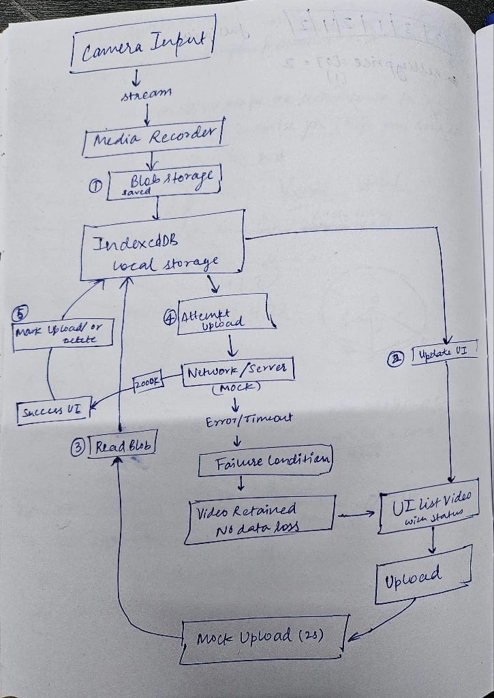

# Persistent Video Recorder

A Next.js web application that demonstrates persistent video recording and storage. Videos are recorded directly in the browser and saved to IndexedDB, allowing them to persist across browser sessions and tabs.

## High Level Architecture



## Features

- **Browser-based Video Recording**: Record video and audio directly from your device camera and microphone
- **Persistent Storage**: Videos are stored in IndexedDB, persisting even after closing the tab or refreshing the page
- **Upload Management**: Simulate video uploads with retry and failure scenarios
- **Video Management**: View, play, and delete recorded videos
- **Progress Tracking**: Real-time status updates on recording and upload operations
- **Responsive UI**: Clean, simple interface that works on desktop and mobile devices

## Tech Stack

- **Framework**: [Next.js](https://nextjs.org/) with TypeScript
- **Storage**: [IndexedDB](https://developer.mozilla.org/en-US/docs/Web/API/IndexedDB_API) via [idb-keyval](https://github.com/jakearchibald/idb-keyval)
- **Styling**: CSS-in-JS inline styles
- **Runtime**: Node.js / Bun

## Prerequisites

- Node.js 18+ or Bun
- A modern browser with support for:
  - MediaRecorder API
  - getUserMedia API
  - IndexedDB

## Getting Started

### Installation

```bash
bun install
```

### Development

```bash
bun dev
```

The application will be available at `http://localhost:3000`

### Production Build

```bash
bun run build
bun start
```

## Usage

1. **Start Recording**: Click the "Start Recording" button to begin capturing video from your camera
2. **Stop Recording**: Click "Stop & Save" to end the recording and save it to device storage
3. **View Saved Videos**: Recorded videos appear in the "Saved on Device" section
4. **Upload Video**: Click "Try Upload" to simulate uploading a video (2-second delay)
5. **Test Failure**: Click "Fail Upload" to test network failure scenarios
6. **Clear Local**: After successful upload, use this to remove the video from local storage
7. **Play Video**: Click "Play" to open the video in a new tab

## Key Components

### VideoRecorderSpike Component (`app/page.tsx`)

The main component that handles:
- Video stream management via `getUserMedia()`
- MediaRecorder initialization with format detection
- IndexedDB persistence using idb-keyval
- UI state management for recording, uploads, and videos

### Key Functions

- `startRecording()`: Initiates camera capture and begins recording
- `stopRecording()`: Stops the MediaRecorder and saves the blob
- `uploadVideo()`: Simulates uploading a video with configurable success/failure
- `deleteVideo()`: Removes a video from IndexedDB
- `loadSavedVideos()`: Retrieves all persisted videos from IndexedDB

## Video Format Support

The application automatically detects and uses the best supported video format on your browser:
1. `video/mp4`
2. `video/webkit`
3. `video/webm;codecs=vp9`
4. `video/webm`

## Storage

Videos are stored in the browser's IndexedDB with the following structure:

```typescript
interface VideoRecord {
  id: string;              // Format: video_[timestamp]
  blob: Blob;              // The video file
  timestamp: string;        // ISO timestamp
  uploaded: boolean;        // Upload status
  mimeType: string;        // Video format
}
```

## Browser Support

- Chrome/Edge 49+
- Firefox 25+
- Safari 10+
- Opera 36+

## Limitations

- Videos are stored locally in the browser (subject to storage quota)
- Storage limit typically 50MB+ depending on browser (check browser's storage quota)
- MediaRecorder support required
- HTTPS recommended for modern browsers (required for camera access in production)

## Development Notes

This is a spike/proof-of-concept application demonstrating:
- Real-time video capture in the browser
- Effective use of IndexedDB for client-side storage
- Upload retry patterns with persistent state
- Mobile-friendly media recording

## License

MIT
